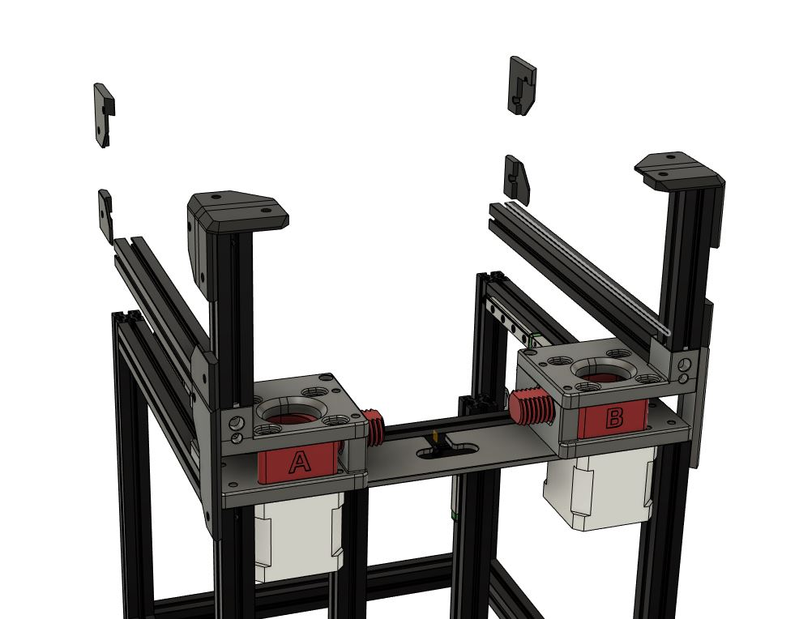
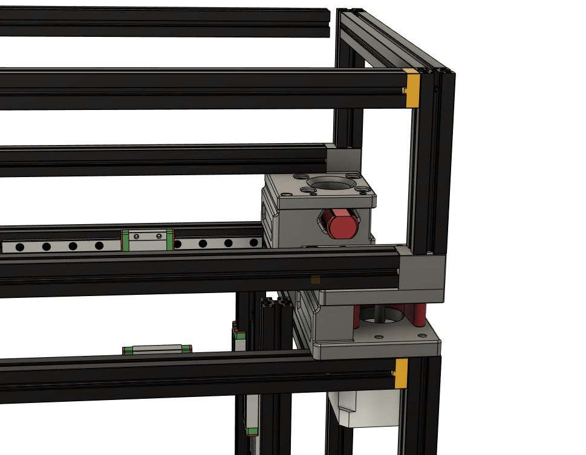

Mod to replace stock nema 14 motors with nema 17 motors

I had extra nema 17 motors and wanted a way to use them on the V0.  No new hardware is needed(other than motors)

You'll reprint the A and B Motor mounts, 6mm extrusion spacers, and new motor plate.

Spacers go in between the extrusions. The same mounting screws can be used for the blind joints.

Updated Panel clips to accomodated the rear expansion and midclips adjusted to center your normal sized side panels.

